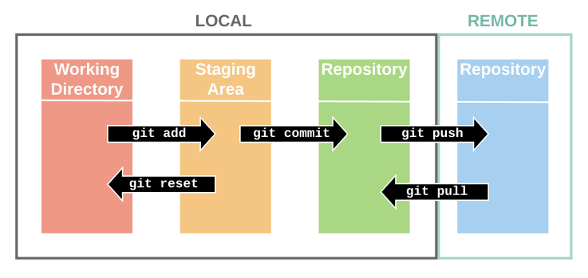

# Git

- git status를 통해서 현재 상태를 확인할 수 있다.
- git add를 통해서 반영할 파일을 추가할 수 있다.
- git commit을 통해서 변경사항을 반영할 수 있다.
- git push를 통해서 로컬 저장소에 있는 값들을 원격 저장소로 업로드 할 수 있다.

# **Markdown**

# #Header1

## ##Header2

### ###Header3

이 이외에도 다양한 명령어가 존재한다.